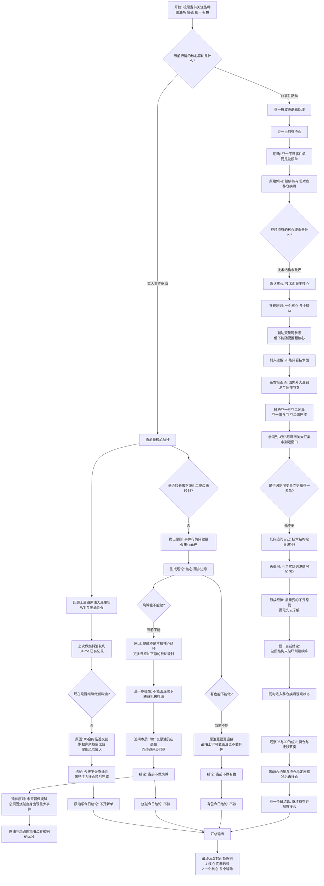
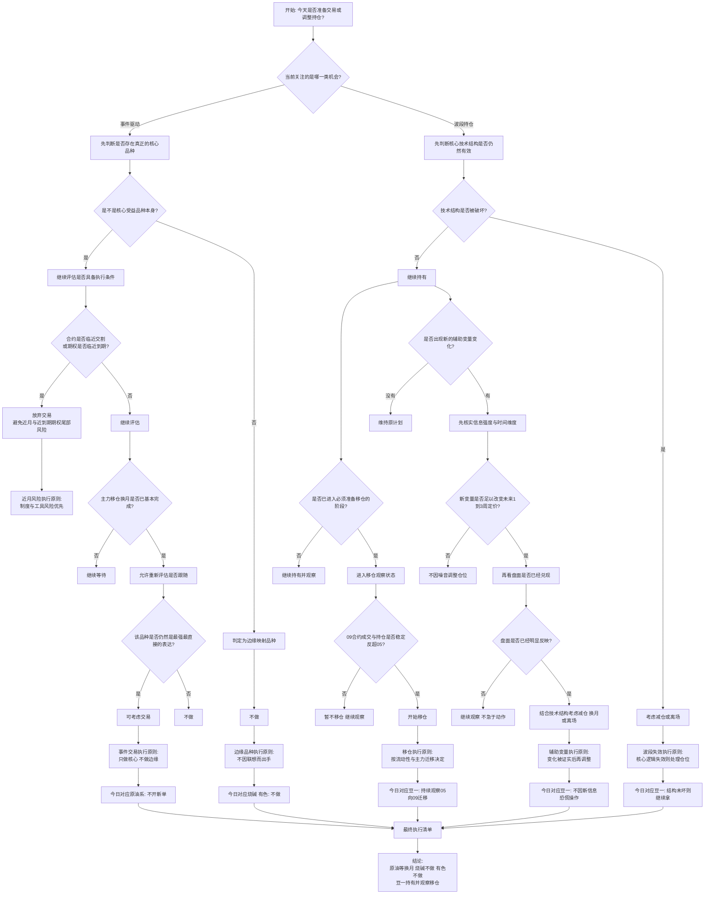

# 2026-04-07

## 今日完成

- [x] 新闻处理
- [x] 思考今天的投资策略
- [x] 编写投资工具开发文档

## 今日策略结论

### 1. 原油系今天不做，先等主力移仓换月完成

上周四国际原油大涨，无论是 WTI 还是美油，走势都很强。这是事实，我也基于这个背景做了燃料油，并在 [04.md](/Users/zxxk/ysd/ysdproject/notes/2026/04.md) 里记录了当时的交易与复盘。

但现在不打算继续做燃料油。原因很明确：

- 燃料油 05 合约已经临近交割
- 燃料油期权只剩大约 10 天到期
- 近月合约和近到期期权的尾部风险都在放大

当前阶段不适合继续在原油系近月合约上硬做。先等主力移仓换月完成，再考虑是否继续跟随，主动避开这段敏感时期。

### 2. 事件驱动要做最强品种，不做边缘映射

这次事件引发的行情，本质上应该做最强、最直接的品种。

如果原油是核心驱动，就优先看原油本身，而不是去做下游化工的被动跟涨品种。不能因为原油涨了，就转去做下游化工，这不是好习惯。事件品种就要做最强的，不要做边缘品种。

基于这个标准：

- 有色暂时不做。虽然有色和原油有时会表现出对立关系，但在当前阶段，原油的驱动更直接、更强，不需要分散到有色上。
- 烧碱暂时不做。烧碱属于化工，下游属性更强，之前更多是被原油带起来的被动炒作，不是这轮逻辑里最核心的品种。

尤其是烧碱，不能因为已经跌了几天，就把它简单理解成抄底机会。要明白它此前为什么涨，也要明白为什么现在原油还在高位，而烧碱已经先回落。说明市场对下游化工的认可度已经弱于对核心原油逻辑的认可度。在这种情况下，去抄烧碱并不占优。

### 3. 豆一继续拿，但要开始准备移仓换月

豆一目前有持仓，这笔交易不是事件驱动，而是波段思路，所以处理方式和原油系不一样。

眼下的结论是：

- 豆一先继续持有
- 但必须开始认真考虑移仓换月

原因是豆一 2605 也是 05 合约，已经进入需要提前准备的阶段。自然人客户不得进入交割月，因此需在 2026 年 4 月 30 日 15:00 前将豆一 2605 合约持仓调整为 0 手。

相关时间点如下：

- 豆一 2605 合约最后交易日为 2026 年 5 月 19 日
- 交割日为 2026 年 5 月 22 日
- 豆一期货主力合约固定在 1、5、9 月轮换
- 豆一 2605 的下一个主力合约是豆一 2609

截至 2026 年 4 月 7 日，豆一 2605 仍然是主力合约，但随着 4 月底临近，资金会逐步向 2609 转移。

目前的策略是：

- 先继续拿着 2605
- 持续关注 2605 和 2609 的成交量与持仓变化
- 等 09 合约的量明显超过 05，再考虑换过去

### 4. 豆二更像阶段性避风港，但也不能放松观察

豆二相对原油更远，当前更像一个阶段性的避风港。它也会受原油系情绪的间接影响，但更重要的还是自身节奏。

做豆二的逻辑比较简单：

- 以波段思路为主
- 主要参考 MACD + 布林线
- 基本面暂时没有太大波动

因此，豆二可以继续按波段思路观察和执行，但不能因为它波动不大就忽视跟踪。后面仍然要持续关注两点：

- 基本面与信息面的变化
- 原油系波动是否通过情绪或成本链条对其形成扰动

### 5. 今日执行结论

- 今天不做原油系单子
- 烧碱等化工暂时不做
- 有色暂时不做
- 豆一按波段思路继续持有
- 豆一开始进入移仓换月观察阶段
- 后续等主力换月完成后，再重新评估原油系机会

## 思考博弈流程图

## 交易决策树

