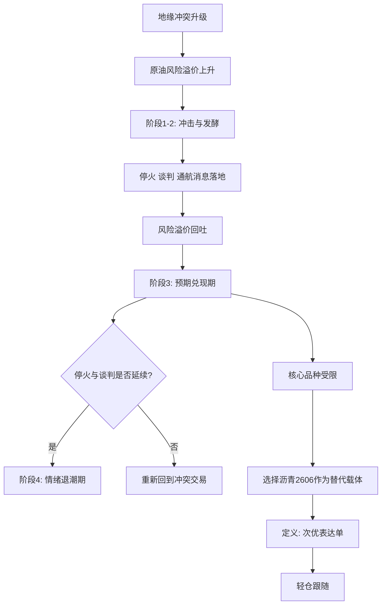

# 2026-04-08

## 核心结论

“突发冲击期 -> 预期发酵期 -> 预期兑现期 -> 情绪退潮期”这套四阶段理论是成立的，可以用于分析当前原油的地缘政治风险溢价演化。

当前更准确的判断是：

> 原油处于第 3 阶段“预期兑现期”，并正在向第 4 阶段“情绪退潮期”过渡。

原因是：

- 停火、谈判、恢复通航这些关键信息已经落地。
- 市场已经开始快速回吐此前因战争和海峡风险计入的溢价。
- 但停火仍是临时性的，谈判尚未最终完成，所以还不能定义为完整的第 4 阶段。

## 当前交易的定义

这次交易的核心驱动不是主观预测，而是：

> 原油地缘政治风险溢价回吐后的跟随。

当前的交易表达应定义为：

- 核心驱动：原油地缘政治风险溢价回吐
- 交易表达：因核心品种受仓位和合约限制，选择沥青 2606 作为替代载体
- 交易级别：次优表达，不是标准核心单
- 仓位处理：仅开 1 手

因此，这笔单不是“核心品种交易”，而是：

> 受交易约束后的替代表达单。

## 失效条件

以下情况出现时，这笔空单的逻辑失效：

1. 出现新的冲突升级。
2. 停火破裂。
3. 谈判明显失败。
4. 原油不再延续从第 3 阶段向第 4 阶段切换的过程。

## 核心推导

## 一句话总结

当前不是在赌谈判结果，而是在跟随原油风险溢价回吐；沥青 2606 空单是受交易约束后的替代表达，成立，但只能按次优表达来管理。
