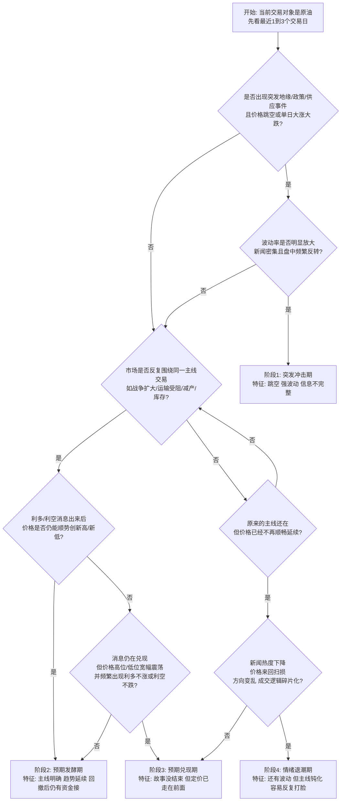

# Crude Oil Phase Diagnosis

Use this skill to classify the current crude oil market into a trading phase, then respond with the matching strategy template.

## Output Rules

- Do not promise a directional win.
- Focus on regime identification first, strategy second.
- Prefer Chinese if the user asks in Chinese.
- If the current phase cannot be distinguished cleanly, say it is a transition state and list the two most likely phases.

## Four Phases

1. `突发冲击期`
   Conditions:
   - A fresh geopolitical, policy, transport, or supply event hits the market.
   - Price gaps or moves sharply within 1 to 3 sessions.
   - Intraday reversals are violent and news flow is dense.
   Default response:
   - Prefer light size or no trade.
   - Avoid chasing the first move without confirmation.

2. `预期发酵期`
   Conditions:
   - The market keeps trading one dominant storyline.
   - Pullbacks are bought or selloffs are pressed again.
   - New headlines still extend the move instead of getting ignored.
   Default response:
   - Trade with the prevailing direction only after confirmation.
   - Avoid top-picking or bottom-picking.

3. `预期兑现期`
   Conditions:
   - The original story is still active, but price stops extending smoothly.
   - Good news fails to push much higher, or bad news fails to push much lower.
   - Range expansion and two-way swings increase.
   Default response:
   - Lower holding-period expectations.
   - Prefer faster trades and tighter discipline.

4. `情绪退潮期`
   Conditions:
   - News is still present, but the market reacts with less consistency.
   - Direction becomes messy and stop-hunts become common.
   - The old storyline no longer produces clean follow-through.
   Default response:
   - Trade less or stand aside.
   - Only act when structure is unusually clear.

## Quick Diagnostic Workflow

Check in this order:

1. Was there a fresh event that changed supply, transport, sanctions, or war risk within the last 1 to 3 sessions?
2. Did price gap or move abnormally hard right after it?
3. Are headlines still extending the same move, or are they being absorbed?
4. Is the market still trending after pullbacks, or has it shifted into broad two-way swings?
5. Has the storyline weakened enough that price is now mostly chopping and trapping?

## Mermaid Template

Use this template when the user asks for a flowchart:

## Response Template

Use this structure when diagnosing the current market:

1. `当前更像哪个阶段`
2. `我这样判断的关键信号`
3. `这个阶段适合什么，不适合什么`
4. `如果判断错了，最容易错在哪`

## Decision Standard

If two adjacent phases overlap, classify by the market behavior rather than the news intensity:

- Still extending the move after pullbacks: lean `预期发酵期`
- Story intact but extension weakens: lean `预期兑现期`
- Story weakens and price action turns noisy: lean `情绪退潮期`
